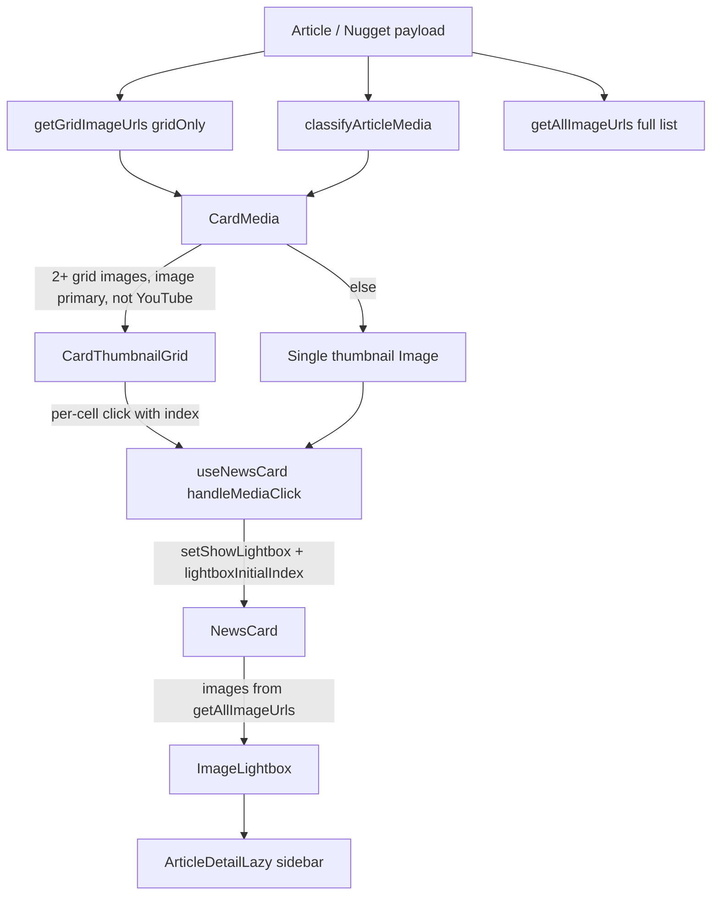

# Nugget multi-image grid and lightbox — greenfield recreation spec

This documents the **canonical implementation** in the Vite React app ([`src/`](src/)), which matches your screenshot (2×2 grid, **+7 more** on the 4th cell, **Source** pill top-right). The Next.js app ([`apps/web-next/`](apps/web-next/)) does **not** yet implement multi-image grids.

---

## 1. Architecture overview



**Component chain (feed/grid cards):**

| Layer | File |
|-------|------|
| Card shell | [`src/components/NewsCard.tsx`](src/components/NewsCard.tsx) |
| Click logic | [`src/hooks/useNewsCard.ts`](src/hooks/useNewsCard.ts) |
| Layout variant | [`src/components/card/variants/GridVariant.tsx`](src/components/card/variants/GridVariant.tsx) (also Feed/Masonry variants) |
| Media gate + wrapper | [`src/components/card/atoms/CardMedia.tsx`](src/components/card/atoms/CardMedia.tsx) |
| Adaptive grid | [`src/components/card/atoms/CardThumbnailGrid.tsx`](src/components/card/atoms/CardThumbnailGrid.tsx) |
| Viewer | [`src/components/ImageLightbox.tsx`](src/components/ImageLightbox.tsx) |
| URL logic | [`src/utils/mediaClassifier.ts`](src/utils/mediaClassifier.ts) |

Repo docs with worked examples: [`MULTI_IMAGE_GRID_DATA_FLOW.md`](MULTI_IMAGE_GRID_DATA_FLOW.md), [`MULTI_IMAGE_GRID_VISUAL_GUIDE.md`](MULTI_IMAGE_GRID_VISUAL_GUIDE.md).

---

## 2. Data model (what the backend should send)

From [`src/types/index.ts`](src/types/index.ts):

```typescript
interface Article {
  id: string;
  title?: string;
  images?: string[];              // Canonical user ordering (drag/drop)
  primaryMedia?: PrimaryMedia;    // One “hero” media item
  supportingMedia?: SupportingMediaItem[];
  media?: NuggetMedia;            // Legacy single-media blob
  externalLinks?: { url: string; isPrimary?: boolean }[];
  // ...
}

interface PrimaryMedia / SupportingMediaItem / NuggetMedia {
  type: 'image' | 'youtube' | 'document' | 'link' | ...;
  url: string;
  thumbnail?: string;
  showInGrid?: boolean;   // default true — false hides from card grid
  showInMasonry?: boolean;
  order?: number;         // alias: position — sort key for classified images
  previewMetadata?: { url?: string; imageUrl?: string; title?: string };
}
```

**Key flags:**
- `showInGrid !== false` → image may appear in card thumbnail grid ([`isVisibleInGrid`](src/utils/mediaClassifier.ts)).
- `images[]` is the **authoritative order** when present; classified primary/supporting URLs are merged without duplicating entries already in `images[]`.

---

## 3. Collecting image URLs (`mediaClassifier.ts`)

### Grid thumbnails: `getGridImageUrls(article)`

```typescript
getGridImageUrls(article) === getAllImageUrls(article, { gridOnly: true })
```

### Full gallery (lightbox): `getAllImageUrls(article)`

**Merge order** ([`getAllImageUrls`](src/utils/mediaClassifier.ts)):

1. Every URL in `article.images[]` (preserves user order).
2. Classified `primaryMedia` (if `type === 'image'`) + `supportingMedia` image items, sorted by `order`/`position` when any item has explicit order metadata.
3. Legacy path: `classifyArticleMedia()` fallback when explicit fields are empty.
4. `article.media` if `type === 'image'`.
5. `article.media.previewMetadata.imageUrl` (OG/unfurl image).

**Dedup:** `normalizeImageUrl()` from [`src/shared/articleNormalization/imageDedup.ts`](src/shared/articleNormalization/imageDedup.ts) (strips query params, case-normalizes for comparison; keeps original URL string in output).

**Grid filter:** skip items where `showInGrid === false`.

### When multi-image grid activates (`CardMedia`)

All must be true ([`CardMedia.tsx` lines 142–147](src/components/card/atoms/CardMedia.tsx)):

| Rule | Reason |
|------|--------|
| `primaryMedia?.type !== 'youtube'` | YouTube always uses single thumbnail + inline player |
| `gridImageUrls.length >= 2` | Need at least 2 grid-visible images |
| `!primaryMedia \|\| primaryMedia.type === 'image'` | Document/link primary blocks grid even if extra images exist |

**Supporting badge:** When **not** in multi-grid mode and `getSupportingMediaCount() > 0`, show bottom-right `Layers` + `+N` badge (different from the 4th-cell **+N more** overlay).

---

## 4. Card media wrapper (`CardMedia`)

- Fixed **16:9** aspect on the media block (`aspectRatio: '16/9'`), `rounded-xl overflow-hidden`.
- Entire block is a focusable `role="button"`; `onClick` / Enter / Space call `onMediaClick`.
- Multi-grid mode renders `CardThumbnailGrid` with `images={gridImageUrls}` and `onGridClick={onMediaClick}`.
- Single-thumb mode uses `object-contain` for uploaded images, `object-cover` for YouTube.

---

## 5. Adaptive grid layouts (`CardThumbnailGrid`)

**Input:** `images: string[]` (from `getGridImageUrls`). Returns `null` if `length < 2`.

| Count | CSS layout | Cells rendered | Overflow |
|-------|------------|----------------|----------|
| **2** | `grid gap-1`; `grid-cols-1 sm:grid-cols-2` (stack on mobile) | 2 | None |
| **3** | `grid-cols-2 grid-rows-2`; first cell `row-span-2` | 3 (tall left + 2 right) | None |
| **4** | `grid-cols-2` (2×2) | 4 | None |
| **5+** | `grid-cols-2` | **First 4** (`slice(0,4)`) | 4th cell overlay |

### +N more overlay (matches screenshot)

For `imageCount > 4`:

```typescript
const remainingCount = imageCount - 4;  // e.g. 11 images → +7 more
```

On **index === 3** (4th cell):

- Full-cell overlay: `bg-black/80 backdrop-blur-sm`, centered column
- `LayoutGrid` icon (lucide, 20px)
- Bold white `+{remainingCount}`
- Smaller `more` label (`text-white/80 text-xs`)
- Overlay has `pointer-events-none` but parent cell click still fires → opens lightbox at **index 3** (the 4th visible image, not the 5th hidden one)

**Per-cell behavior:**
- `object-cover` fill, `bg-slate-100` cell background
- Hover: `bg-black/20` overlay on each cell
- Loading skeleton (`animate-pulse`), error state with “Try again” retry
- `buildFeedImageResponsiveProps(url)` for Cloudinary `srcset` ([`src/utils/feedImageResponsive.ts`](src/utils/feedImageResponsive.ts))
- First cell can get `loading="eager"` + `fetchPriority="high"` when card is above-the-fold
- `sizes`: [`FEED_CARD_GRID_CELL_IMAGE_SIZES`](src/constants/feedImageLayout.ts)

---

## 6. “Source” button (screenshot top-right)

**Not part of the image grid.** Rendered by [`GridVariant.tsx`](src/components/card/variants/GridVariant.tsx) as an absolute overlay on the media block:

- Position: `absolute top-2 right-2 z-20`
- Style: `bg-black/70 backdrop-blur-sm`, pill, `ExternalLink` icon + “Source”
- **Action:** `window.open(url, '_blank', 'noopener,noreferrer')` with `e.stopPropagation()` — does **not** open lightbox

**URL priority:**

1. `externalLinks.find(isPrimary).url`
2. `media.previewMetadata.url` (hidden for YouTube)
3. `media.url` only when `media.type === 'link'`

Cloudinary image URLs from `images[]` are intentionally **not** used as source links.

---

## 7. Click behavior: card → lightbox

### Handler ([`useNewsCard.ts` `handleMediaClick`](src/hooks/useNewsCard.ts))

```
e.stopPropagation()  // Prevents opening article drawer

if YouTube primary → playVideo() inline mini-player (NOT lightbox)

if allImageUrls.length > 0 OR media.type === 'image':
  if imageIndex !== undefined → setLightboxInitialIndex(imageIndex)
  setShowLightbox(true)
  return

else if link URL → LinkPreviewModal
else → ArticleModal (full article)
```

### Wiring ([`NewsCard.tsx`](src/components/NewsCard.tsx))

Lightbox image list is built **only when open** (perf):

```typescript
const urls = getAllImageUrls(originalArticle);
// NOT gridOnly — includes images hidden from grid (showInGrid: false)
<ImageLightbox
  images={urls}
  initialIndex={modals.lightboxInitialIndex || 0}
  sourceLinksPerImage={buildLightboxSourceLinksForImageUrls(article, urls)}
  sidebarContent={<ArticleDetailLazy article={...} />}
/>
```

### Index mapping caveat (important for greenfield)

- Grid passes **index into `gridImageUrls`** (grid-visible only).
- Lightbox uses **`getAllImageUrls`** (all images).

If some images have `showInGrid: false`, grid indices **may not match** lightbox indices. For recreation: either map clicked URL → index in full list, or ensure both lists share the same ordering/filter rules.

Clicking the **+N more** cell opens lightbox at index **3** (4th image), not the first hidden image.

---

## 8. `ImageLightbox` — viewer spec

**File:** [`src/components/ImageLightbox.tsx`](src/components/ImageLightbox.tsx)

### Modes

| Condition | Initial mode | UI |
|-----------|--------------|-----|
| 1 image | `fullscreen` | Full viewport, zoom/pan |
| 2+ images + `sidebarContent` | `carousel` (two-panel) | Left: image carousel; right: article detail (~400px desktop) |
| 2+ images, no sidebar | `fullscreen` | Full viewport with nav |

**Progressive disclosure (multi + sidebar):**

1. Opens in **two-panel** carousel + article sidebar
2. Click image → **fullscreen** zoom view
3. `Esc` in fullscreen → back to two-panel
4. `Esc` in two-panel → close
5. Hint text: “Click image to view fullscreen”

### Navigation

- **Chevrons:** prev/next (wraps: last → first)
- **Counter:** `{currentIndex + 1} / {images.length}` top center
- **Keyboard:** `Esc` (mode-aware); `ArrowLeft`/`ArrowRight` only in **fullscreen** or when **no sidebar** (not in two-panel carousel mode)
- **Touch swipe** (threshold 50px, when not zoomed):
  - Horizontal → prev/next image
  - Vertical down → close
- **Fullscreen zoom:** mouse wheel ±10%; drag pan when zoom > 1; pinch-zoom mobile; double-tap toggles 1× ↔ 2×

### Source pill in lightbox

Per-slide optional `sourceLinksPerImage[currentIndex]` — same external-link resolution as cards, opens in new tab (`buildLightboxSourceLinksForImageUrls` in [`masonryMediaHelper.ts`](src/utils/masonryMediaHelper.ts)).

### Portal + scroll lock

- `createPortal` to modal overlay host
- `document.body.style.overflow = 'hidden'` while open
- Safe-area padding for notched devices

---

## 9. Responsive images (performance)

[`buildFeedImageResponsiveProps`](src/utils/feedImageResponsive.ts):

- For Cloudinary `/image/upload/` URLs: build `srcSet` at widths `[320, 480, 640, 960]` with transform `w_{N},c_limit,q_auto,f_auto`
- Otherwise: plain `src` only
- Grid cells use `FEED_CARD_GRID_CELL_IMAGE_SIZES`; hero thumb uses `FEED_CARD_HERO_IMAGE_SIZES`

---

## 10. Edge cases to test in greenfield

| Scenario | Expected behavior |
|----------|-------------------|
| YouTube primary + image supporting media | Single YouTube thumb; **no** 2×2 grid |
| 1 image only | Single thumbnail, lightbox fullscreen |
| 10 images | 2×2 of first 4; 4th shows **+6 more** (screenshot shows +7 → 11 total) |
| `showInGrid: false` on some images | Omitted from grid; may still appear in lightbox |
| `primaryMedia: null` + `images[]` length ≥ 2 | Grid still renders |
| Primary is document/link | Single thumb path, no grid |
| Broken image URL | Skeleton → error UI with retry per cell |
| Click Source button | New tab only; no lightbox |
| Click grid cell | Lightbox at that index; `stopPropagation` (no drawer) |
| Click card body/title | Article drawer/modal (separate from media click) |

---

## 11. Greenfield implementation checklist

**Data layer (port first):**

- [ ] `getAllImageUrls` / `getGridImageUrls` with `images[]` order, dedup, `showInGrid`, OG `previewMetadata.imageUrl`
- [ ] `classifyArticleMedia` (YouTube > image > document priority)
- [ ] `shouldRenderMultiImageGrid` gate

**Card UI:**

- [ ] 16:9 media container
- [ ] `CardThumbnailGrid` layouts for 2 / 3 / 4 / 5+ counts
- [ ] +N overlay on 4th cell when `count > 4`
- [ ] `object-cover` cells, hover dim, loading/error states
- [ ] Optional Cloudinary `srcset` builder
- [ ] Source pill overlay (external URL, separate from grid clicks)

**Interaction:**

- [ ] `handleMediaClick(e, imageIndex?)` with stopPropagation
- [ ] Lazy-fetch full URL list when lightbox opens
- [ ] Map clicked URL → index in **full** list (fix grid/lightbox index drift)
- [ ] `ImageLightbox` with two-panel + fullscreen modes, swipe, zoom, keyboard rules
- [ ] Article sidebar in two-panel mode (optional but matches production UX)

**Out of scope for card grid (different surfaces):**

- [`SupportingMediaSection.tsx`](src/components/shared/SupportingMediaSection.tsx) — drawer detail grid (5th placeholder cell for overflow, not 4th-cell overlay)
- [`ImageGrid.tsx`](src/components/card/atoms/ImageGrid.tsx) — legacy duplicate, **unused**
- [`ImageCarouselModal.tsx`](src/components/shared/ImageCarouselModal.tsx) — simpler modal, not used on feed cards

---

## 12. Reference: core code anchors

**Grid gate:**

```142:147:src/components/card/atoms/CardMedia.tsx
  const shouldRenderMultiImageGrid = useMemo(() => {
    if (primaryMedia?.type === 'youtube') return false;
    if (gridImageUrls.length < 2) return false;
    if (primaryMedia && primaryMedia.type !== 'image') return false;
    return true;
  }, [primaryMedia, gridImageUrls.length]);
```

**+N overlay:**

```283:317:src/components/card/atoms/CardThumbnailGrid.tsx
  const displayImages = images.slice(0, 4);
  const remainingCount = imageCount - 4;
  // ...
  {idx === 3 && remainingCount > 0 && (
    <motion.div className="absolute inset-0 bg-black/80 backdrop-blur-sm ...">
      <LayoutGrid ... />
      <span>+{remainingCount}</span>
      <span>more</span>
    </motion.div>
  )}
```

**Open lightbox on image click:**

```418:426:src/hooks/useNewsCard.ts
    if (allImageUrls.length > 0 || article.media?.type === 'image') {
      if (imageIndex !== undefined) {
        setLightboxInitialIndex(imageIndex);
      }
      setShowLightbox(true);
      return;
    }
```

**Lightbox mount:**

```295:316:src/components/NewsCard.tsx
        {modals.showLightbox && (
          <ImageLightbox
            images={lightboxImageUrls}
            initialIndex={modals.lightboxInitialIndex || 0}
            sidebarContent={<ArticleDetailLazy article={originalArticle} ... />}
          />
        )}
```
