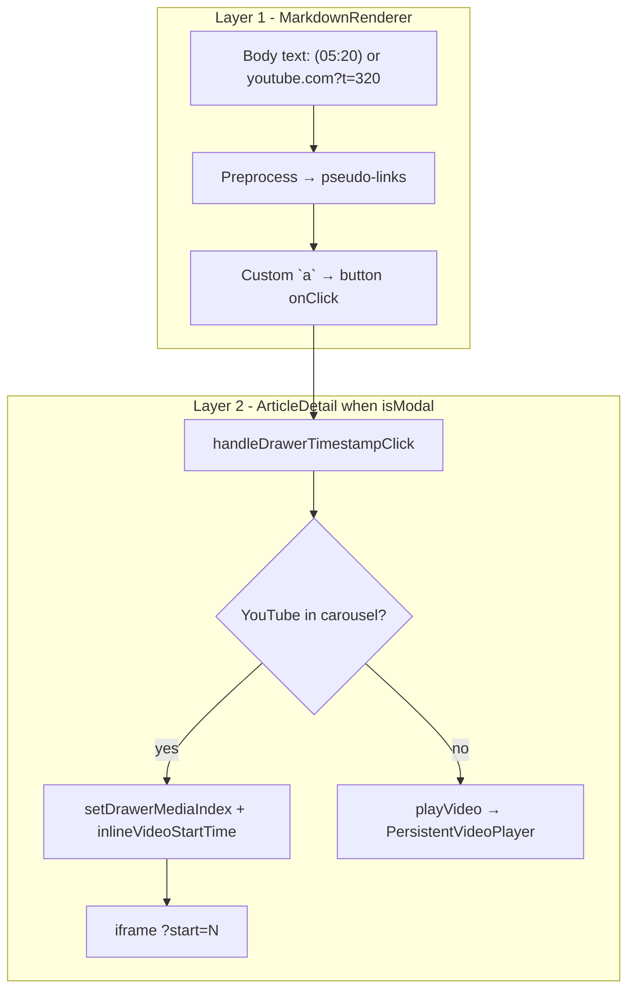

# YouTube timestamp clicking — architecture and recreation guide

## Executive summary

Timestamp clicking is a **three-layer pipeline**:

1. **Detect & render clickable timestamps** in markdown ([`MarkdownRenderer.tsx`](src/components/MarkdownRenderer.tsx))
2. **Parse seconds** from plain text or YouTube URLs ([`youtubeUtils.ts`](src/utils/youtubeUtils.ts))
3. **Seek the player** via either **inline carousel iframe** (modal/drawer) or **global mini-player** (feed cards / fallback) ([`ArticleDetail.tsx`](src/components/ArticleDetail.tsx), [`VideoPlayerContext.tsx`](src/context/VideoPlayerContext.tsx))

**Mobile vs desktop:** The product uses different **shells** (`ArticleModal` on narrow/single-column vs `ArticleDrawer` on desktop grid at `lg` / 1024px), but both pass `isModal={true}` into the same `ArticleDetail`. Timestamp **seek logic is identical**; mobile-only differences are **touch UX** (carousel swipe, jump-to-player, tap targets, `playsinline`).



---

## 1. Where the feature appears (routing)

| Entry point | Shell | Breakpoint / condition | Timestamp handler |
|-------------|-------|------------------------|-------------------|
| Home single-column | [`ArticleModal`](src/components/ArticleModal.tsx) | [`HomePage`](src/pages/HomePage.tsx) `selectedArticle` | **None passed** — `ArticleDetail` handles internally |
| Home desktop grid | [`ArticleDrawer`](src/components/ArticleDrawer.tsx) | `viewMode === 'grid' && isDesktop` (`min-width: 1024px`) in [`HomeArticleFeed`](src/components/feed/HomeArticleFeed.tsx) / [`ArticleGrid`](src/components/ArticleGrid.tsx) | Parent passes **noop** `handleYouTubeTimestampClick` — still works via internal path |
| Card “read more” | `ArticleModal` from [`NewsCard`](src/components/NewsCard.tsx) | Per-card | Parent passes handler but **ignored** when `isModal={true}` |

Spec reference: [`docs/ui/article-detail-drawer-ui-spec.md`](docs/ui/article-detail-drawer-ui-spec.md) §1, §8–9.

**Nuggets v3 (current):** Implemented via deferred global mini-player — not inline carousel iframe. See v3 file map in §9.

| Legacy (Project Phoenix) | Nuggets v3 |
|--------------------------|------------|
| `MarkdownRenderer` + `(MM:SS)` preprocess | [`lib/markdown/normalize-youtube-timestamps.ts`](../lib/markdown/normalize-youtube-timestamps.ts) + [`ArticleBody`](../components/ui/article-body.tsx) |
| `handleDrawerTimestampClick` / inline iframe | [`TimestampLinkInterceptor`](../components/ui/timestamp-link-interceptor.tsx) → [`GlobalYouTubeMiniPlayer`](../components/ui/global-youtube-mini-player.tsx) |
| Jump-to-player FAB | [`YouTubeJumpToHero`](../components/ui/youtube-jump-to-hero.tsx) |
| `youtubeUtils` URL parsing | [`lib/ui/youtube-inline-url.ts`](../lib/ui/youtube-inline-url.ts) |

Canonical author syntax in v3: `[label](#yt={seconds})`. Legacy `(MM:SS)` is normalized at render time (and via optional ETL `backfill:youtube-timestamp-links`).

---

## 2. Layer 1 — Making timestamps clickable (`MarkdownRenderer`)

### 2.1 Opt-in via callback

Timestamp conversion only runs when `onYouTubeTimestampClick` is provided:

```199:231:src/components/MarkdownRenderer.tsx
    if (onYouTubeTimestampClick) {
      processed = processed.replace(
        /(^|[^[])\s*\((\d{1,2}):(\d{2}):(\d{2})\)/g,
        // → [match](youtube-timestamp:{totalSeconds})
      );
      processed = processed.replace(
        /(^|[^[])\s*\((\d{2}):(\d{2})\)/g,
        // → [match](youtube-timestamp:{totalSeconds})
      );
    }
```

**Supported author formats:**
- `(MM:SS)` e.g. `(05:20)` → seconds = `5*60 + 20`
- `(H:MM:SS)` e.g. `(1:23:45)` → hours + minutes + seconds
- Real YouTube URLs with `t=` / `time_continue` (handled in custom link renderer, not preprocessing)

The `(^|[^[])` prefix avoids rewriting timestamps already inside markdown link syntax.

### 2.2 Custom link component → buttons (critical for mobile)

YouTube and pseudo-timestamp links render as **`<button type="button">`**, not `<a href>`:

- `e.preventDefault()` + `e.stopPropagation()` — prevents modal backdrop / card click from stealing the tap
- Brief highlight flash via `activeTimestampHref` (900ms) for touch feedback
- Plain-text timestamps call `onYouTubeTimestampClick('', timestamp, '')` — empty `videoId` means “use article’s video”
- YouTube URLs call `extractYouTubeVideoIdAndTimestamp(href)` then `onYouTubeTimestampClick(videoId, startTime, href)`

```273:320:src/components/MarkdownRenderer.tsx
        if (href?.startsWith('youtube-timestamp:') && onYouTubeTimestampClick) {
          // button → onYouTubeTimestampClick('', timestamp, '')
        }
        if (href && isYouTubeUrl(href) && onYouTubeTimestampClick) {
          const { videoId, timestamp } = extractYouTubeVideoIdAndTimestamp(href);
          // button → onYouTubeTimestampClick(videoId, startTime, href)
        }
```

**Recreation tip:** On touch UIs, always use buttons (or `role="button"` with keyboard handlers) inside scrollable overlays; anchor navigation will fight your modal gesture handling.

### 2.3 URL timestamp parsing (`youtubeUtils`)

[`extractYouTubeTimestamp`](src/utils/youtubeUtils.ts) supports:
- `t=36` (numeric seconds)
- `t=1m30s`, `t=36s`, `t=1h2m30s`
- `time_continue` query param
- Regex fallback if `URL` constructor fails

[`extractYouTubeVideoId`](src/utils/youtubeUtils.ts) handles `watch?v=`, `youtu.be/`, `/embed/`, etc.

---

## 3. Layer 2 — Modal/drawer seek behavior (`ArticleDetail`)

### 3.1 Wiring

In modal mode, body markdown passes the **internal** handler (not the parent prop):

```614:617:src/components/ArticleDetail.tsx
                    <MarkdownRendererLazy
                      content={resolvedBodyContent}
                      onYouTubeTimestampClick={handleDrawerTimestampClick}
                    />
```

`ArticleModal` / `ArticleDrawer` may accept `onYouTubeTimestampClick`, but when `isModal={true}` the parent callback is **never invoked** for body timestamps.

### 3.2 Media carousel prerequisite

When `isModal={true}`, a carousel is built from `classifyArticleMedia(article)` → deduped `drawerMediaItems` (images, primary media, supporting media). The first `type === 'youtube'` item sets `youtubeCarouselIndex`.

### 3.3 `handleDrawerTimestampClick` decision tree

```326:356:src/components/ArticleDetail.tsx
  const handleDrawerTimestampClick = useCallback(
    (videoId, timestamp, originalUrl) => {
      if (!isModal) {
        // delegate to parent OR playVideo fallback
        return;
      }
      if (youtubeCarouselIndex >= 0) {
        setDrawerMediaIndex(youtubeCarouselIndex);
        setInlineVideoStartTime(timestamp);
      } else if (articleYouTubeUrl) {
        playVideo({ videoUrl: articleYouTubeUrl, startTime: timestamp, ... });
      } else if (originalUrl) {
        window.open(originalUrl, '_blank', 'noopener,noreferrer');
      }
    },
    [...]
  );
```

**Primary path (most articles with embedded YouTube):**
1. Jump carousel to YouTube slide
2. Set `inlineVideoStartTime` to clicked seconds
3. UI swaps thumbnail → iframe

### 3.4 Inline iframe with `start` param

Activation condition:

```380:381:src/components/ArticleDetail.tsx
  const shouldShowInlineVideo = isModal && isCurrentItemYouTube && inlineVideoStartTime !== null;
```

Embed URL (privacy-enhanced host + mobile-friendly flags):

```388:404:src/components/ArticleDetail.tsx
    const params = new URLSearchParams({
      rel: '0', modestbranding: '1', playsinline: '1', autoplay: '1', ...
    });
    if (inlineVideoStartTime && inlineVideoStartTime > 0) {
      params.set('start', String(Math.floor(inlineVideoStartTime)));
    }
    return `https://www.youtube-nocookie.com/embed/${vId}?${params.toString()}`;
```

**`key={inlineEmbedUrl}`** on the iframe forces remount when `start` changes so YouTube actually seeks on repeated timestamp clicks.

Thumbnail click (no timestamp) sets `setInlineVideoStartTime(0)` to play from the beginning.

### 3.5 Fallback: global mini-player

If the article has a YouTube URL but **no** carousel YouTube item, `playVideo()` from [`VideoPlayerContext`](src/context/VideoPlayerContext.tsx) opens [`PersistentVideoPlayer`](src/components/PersistentVideoPlayer.tsx) with the same `start` query param pattern.

---

## 4. Mobile / small-screen behavior (UX, not separate logic)

There is **no** `if (mobile)` branch in timestamp handling. These pieces matter on small screens:

### 4.1 Full-width modal shell

[`ArticleModal`](src/components/ArticleModal.tsx): `w-full md:w-1/2` — tall scrollable content; carousel + body share `#drawer-content` scroll container.

### 4.2 Touch-friendly carousel swipe

Horizontal swipe (40px threshold) changes slides **only when inline video is NOT showing** (avoids fighting the iframe):

```513:527:src/components/ArticleDetail.tsx
                          onTouchStart={... if (shouldShowInlineVideo) return; ...}
                          onTouchEnd={... deltaX > 40 → prev/next; resets inlineVideoStartTime on slide change }
```

### 4.3 “Jump to player” floating button

[`IntersectionObserver`](src/components/ArticleDetail.tsx) on carousel vs `#drawer-content` root; when `intersectionRatio < 0.2`, show fixed `bottom-4 right-4` button that `scrollIntoView`s the carousel. Especially useful after tapping a timestamp, reading below, then wanting to return to video on a long mobile page.

### 4.4 Mini-player touch dismiss (feed / fallback path)

[`PersistentVideoPlayer`](src/components/PersistentVideoPlayer.tsx): responsive width `min(280px, calc(100vw - 32px))`, safe-area insets, swipe-down/left dismiss on drag handle (iframe captures touches on video area).

### 4.5 `playsinline=1`

Set on both inline and mini-player embeds so iOS plays in-page instead of forcing fullscreen.

---

## 5. Feed card path (before opening modal)

When user clicks a timestamp **on the card** (not in modal):

1. [`useNewsCard.handleYouTubeTimestampClick`](src/hooks/useNewsCard.ts) resolves article YouTube URL
2. Always calls `playVideo({ startTime: timestamp })` — **mini player**, not inline carousel
3. Requires **expanded** card body with full `MarkdownRenderer` (`needsFullMarkdownBody` in [`CardContent`](src/components/card/atoms/CardContent.tsx)); collapsed cards use `LightweightMarkdownExcerpt` which **does not** support timestamps

`NewsCard` passes `onYouTubeTimestampClick` into `ArticleModal`, but that prop is unused for modal body content because `isModal` short-circuits to internal handler.

---

## 6. Recreation checklist (copy to a new app)

### Required building blocks

| Piece | Responsibility |
|-------|----------------|
| `parseTimestamp` / `extractYouTubeVideoId` | Normalize `t=` and `(MM:SS)` to seconds |
| Markdown preprocessor | `(MM:SS)` → internal link scheme |
| Custom markdown link renderer | YouTube + pseudo-links → buttons with `stopPropagation` |
| `(videoId, seconds, originalUrl) => void` callback | Single contract through markdown → container |
| Media carousel + state | `mediaIndex`, `inlineStartTime`, `showInline = startTime !== null` |
| Embed URL builder | `youtube-nocookie.com/embed/{id}?autoplay=1&playsinline=1&start={n}` |
| iframe `key` tied to full embed URL | Remount on seek |
| Optional global player context | Fallback when video URL exists but no inline slot |
| Scroll root `id` + IntersectionObserver | “Jump to player” on long mobile pages |

### Minimal state machine (modal path)

```
States:
  THUMBNAIL — carousel shows EmbeddedMedia preview
  PLAYING_INLINE — iframe mounted with start=N (N may be 0)

Transitions:
  click timestamp → PLAYING_INLINE(start=N), index=youtubeSlide
  click thumbnail on YouTube slide → PLAYING_INLINE(start=0)
  swipe carousel while PLAYING_INLINE → blocked
  swipe carousel while THUMBNAIL → change slide, clear inline start
  new article → reset index + inline start
```

### Callback signature to standardize

```ts
type YouTubeTimestampHandler = (
  videoId: string,      // '' = infer from article context
  timestamp: number,    // seconds
  originalUrl: string,  // for fallback window.open
) => void;
```

### Common pitfalls

- Using `<a target="_blank">` inside modals → breaks in-app seek
- Forgetting `stopPropagation` → parent closes modal or navigates
- Reusing iframe without `key` change → YouTube ignores new `start`
- Omitting `playsinline=1` → poor iOS behavior
- Expecting timestamps in lightweight excerpt renderer → need full markdown path
- Passing parent handler to modal but never calling it when `isModal` → confusing double API; pick one owner

---

## 7. Key files (reference map)

### Legacy (Project Phoenix)

| File | Role |
|------|------|
| `src/components/MarkdownRenderer.tsx` | Parse `(MM:SS)`, render timestamp buttons |
| `src/utils/youtubeUtils.ts` | Video ID + `t=` parsing |
| `src/components/ArticleDetail.tsx` | Carousel, inline iframe, `handleDrawerTimestampClick` (**superseded in v3**) |
| `src/context/VideoPlayerContext.tsx` | Global `playVideo` state |
| `src/components/PersistentVideoPlayer.tsx` | Floating PIP iframe |

### Nuggets v3 (current)

| File | Role |
|------|------|
| [`lib/markdown/normalize-youtube-timestamps.ts`](../lib/markdown/normalize-youtube-timestamps.ts) | `(MM:SS)` → `[label](#yt=N)` at render / ETL |
| [`lib/ui/youtube-inline-url.ts`](../lib/ui/youtube-inline-url.ts) | `#yt=`, `t=`, `time_continue`, video id parsing |
| [`lib/ui/youtube-hero-scroll.ts`](../lib/ui/youtube-hero-scroll.ts) | `#nugget-youtube-hero` scroll helper |
| [`components/ui/timestamp-link-interceptor.tsx`](../components/ui/timestamp-link-interceptor.tsx) | Detail body click delegation → mini-player |
| [`components/ui/card-preview-youtube-timestamps.tsx`](../components/ui/card-preview-youtube-timestamps.tsx) | Feed card preview timestamps |
| [`components/ui/global-youtube-mini-player.tsx`](../components/ui/global-youtube-mini-player.tsx) | Deferred portal player |
| [`components/ui/youtube-jump-to-hero.tsx`](../components/ui/youtube-jump-to-hero.tsx) | Jump-to-hero FAB when scrolled past poster |
| [`components/ui/article-content.tsx`](../components/ui/article-content.tsx) | Hero id, doc scroll root, wires interceptor + jump FAB |
| [`scripts/migrate/backfill-youtube-timestamp-links.ts`](../scripts/migrate/backfill-youtube-timestamp-links.ts) | Optional DB backfill for `(MM:SS)` |
| [`docs/ARTICLE_DETAIL_DRAWER_UI_SPEC.md`](ARTICLE_DETAIL_DRAWER_UI_SPEC.md) | Visual + interaction spec |

---

## 8. Behavioral matrix (quick reference)

| Context | `isModal` | On timestamp click |
|---------|-----------|----------------------|
| Article modal/drawer body | `true` | Inline carousel iframe at `start`, or mini-player if no carousel YouTube |
| Article detail standalone / lightbox sidebar | `false` | Parent handler or `playVideo` |
| Expanded feed card | N/A | Mini-player via `useNewsCard` |
| Collapsed feed card | N/A | No timestamps (lightweight excerpt) |
| HomePage `ArticleModal` | `true` | Internal only (no parent prop) |
